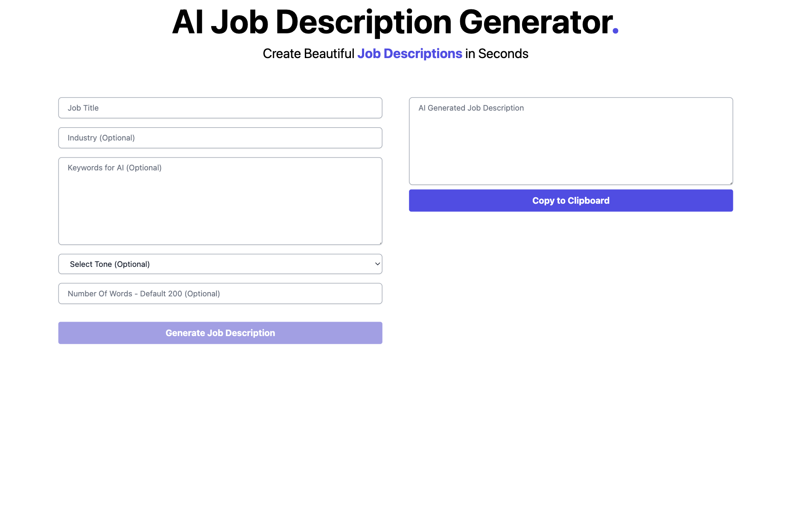
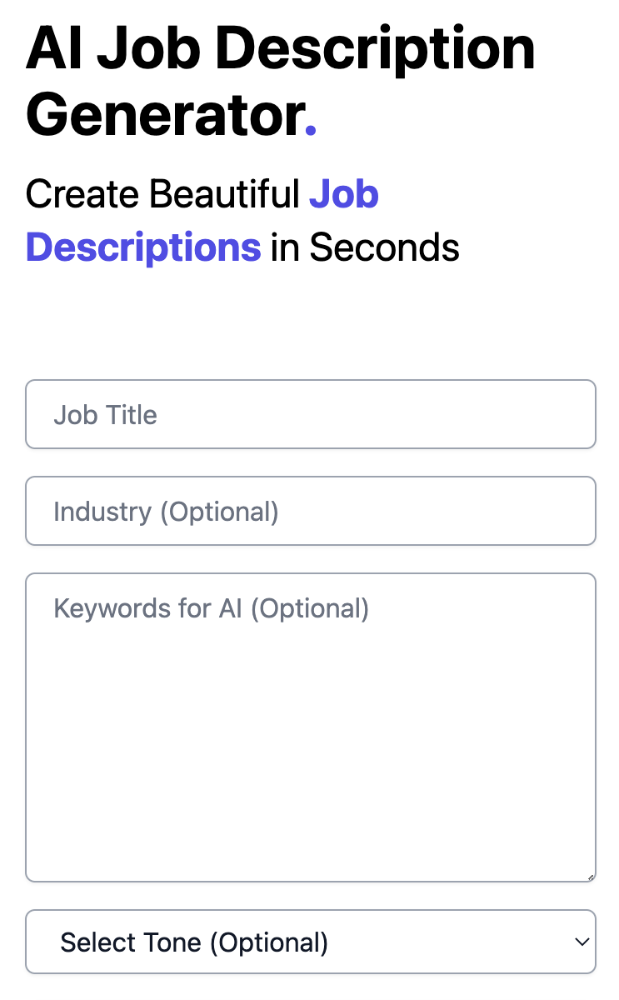

# AI Job Description Generator

Utilizies Next.js, OpenAI ChatGPT and TailwindCSS to generate job descriptions.

## Table of contents

- [Overview](#overview)
  - [Features](#features)
  - [Screenshots](#screenshots)
  - [Demo](#demo)
- [My process](#my-process)
  - [Built with](#built-with)
  - [Layout](#layout)
- [Author](#author)

## Overview

### Features

Users should be able to:

- View the optimal layout depending on their device's screen size
- Generate custom job descriptions
- Copy the generated job descriptions

### Screenshots

### Demo

- Live Site: [Vercel]()

## My process

### Built with

- [Next.js](https://nextjs.org/)
- [OpenAi](https://openai.com)
- [TailwindCSS](https://tailwindcss.com/)

### Layout

The designs were created to the following widths:

- Mobile: 375px
- Desktop: 1440px

## Author

- Instagram - [@nesdevs](https://www.instagram.com/nesdevs/)
- Twitter - [@officialnesdevs](https://www.twitter.com/officialnesdevs)
